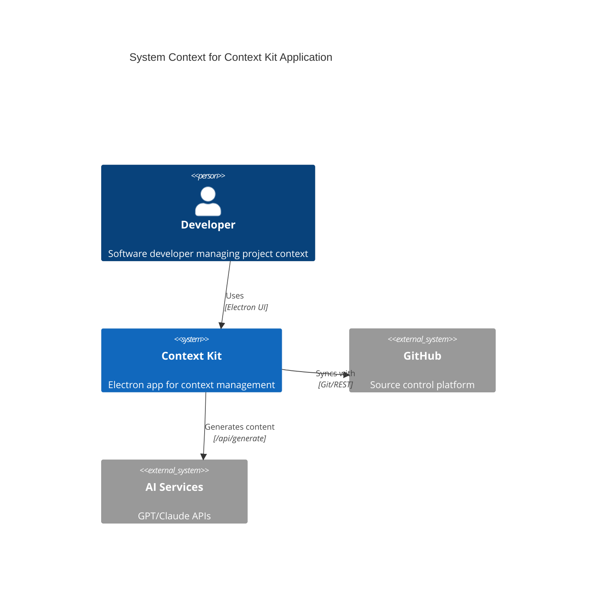

%%c4: system=ContextKit level=C2 feature=FEAT-001

```mermaid
C4Context
  title System Context for Context Kit Application
  
  Person(developer, "Developer", "Software developer managing project context")
  System(contextKit, "Context Kit", "Electron app for context management")
  System_Ext(github, "GitHub", "Source control platform")
  System_Ext(ai, "AI Services", "GPT/Claude APIs")
  
  Rel(developer, contextKit, "Uses", "Electron UI")
  Rel(contextKit, github, "Syncs with", "Git/REST")
  Rel(contextKit, ai, "Generates content", "/api/generate")
```
