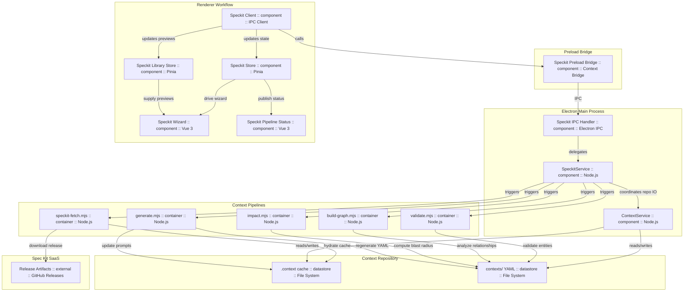

# Component Diagram: Context-Sync Spec Kit Integration

## Main Process Components
- **Speckit IPC Handler** – Routes renderer IPC calls to the Spec Kit orchestration APIs with strict argument validation.
- **SpeckitService** – Coordinates fetches, derives pipeline entity metadata, and enforces the sequential validate → build-graph → impact → generate chain.
- **ContextService** – Provides file-system level helpers for validation, graph, impact, and template generation pipelines, including stale lock cleanup.

## Preload Bridge
- **Speckit Preload Bridge** – Exposes `window.api.speckit` methods inside the isolated renderer, ensuring only typed operations reach the main process.

## Renderer Workflow Components
- **Speckit Client** – IPC convenience wrapper translating renderer options into orchestrator calls and normalizing paths.
- **Speckit Store** – Pinia store orchestrating entity generation, pipeline status, and stale-cache messaging.
- **Speckit Library Store** – Pinia store providing preview filtering/searching sourced from the cached Spec Kit release.
- **Speckit Wizard** – Multi-step workflow integrating fetch, preview selection, and entity generation.
- **Speckit Pipeline Status** – Vue component surfacing per-stage pipeline results, generated file paths, and linked Spec Kit previews.

## Context Pipelines
- **speckit-fetch.mjs** – Fetches release-tagged Spec Kit bundles, writing provenance into `.context/state/speckit-fetch.json` and refreshing cache directories.
- **validate.mjs / build-graph.mjs / impact.mjs / generate.mjs** – Sequential pipelines run after entity generation; failures halt later stages and report errors back through the Pinia store.

## Spec Kit SaaS Integration
- **Release Artifacts** – GitHub releases that host Spec Kit markdown/templates; network failures fall back to the prior cached snapshot while the UI advertises stale status after seven days.

## Context Repository Data Stores
- **.context cache** – Holds cached Spec Kit releases and pipeline telemetry, including freshness timestamps.
- **contexts/ YAML** – Holds generated entities updated by the renderer workflow and validated by downstream pipelines.
