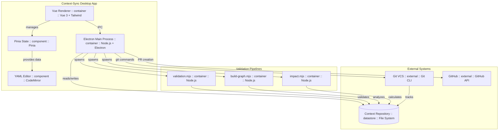

# Context-Sync MVP Architecture

This diagram shows the container-level architecture (C2) of the Context-Sync desktop application.

## Components

### Desktop Application (Context-Sync)
- **Electron Main Process** - Node.js backend handling file I/O, Git operations, and pipeline execution
- **Vue Renderer** - Frontend UI built with Vue 3 and Tailwind CSS
- **Pinia State** - Centralized state management for entities and application state
- **YAML Editor** - CodeMirror-based editor with live schema validation

### External Systems
- **Git VCS** - Version control system (svc-git)
- **Context Repository** - File system-based YAML entity storage
- **GitHub** - Remote repository hosting and PR management

### Validation Pipelines
- **validation.mjs** - AJV-based schema validation (SPEC-001)
- **build-graph.mjs** - Dependency graph construction
- **impact.mjs** - Impact analysis for changed entities

## Features Implemented

This architecture supports:
- **US-001**: Validate context repository against defined schemas
- **US-002**: Visualize dependency graph of context entities
- **FEAT-001**: Context-Sync MVP with automated consistency checking

## Technology Stack

- **Desktop**: Electron 38, Node.js 22
- **Frontend**: Vue 3, Pinia, Tailwind CSS 4, CodeMirror
- **Validation**: AJV, YAML parser
- **VCS**: simple-git, GitHub CLI
