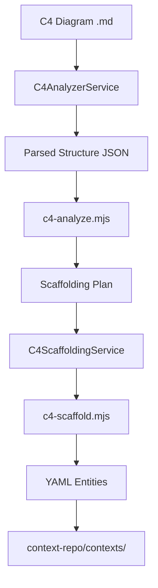
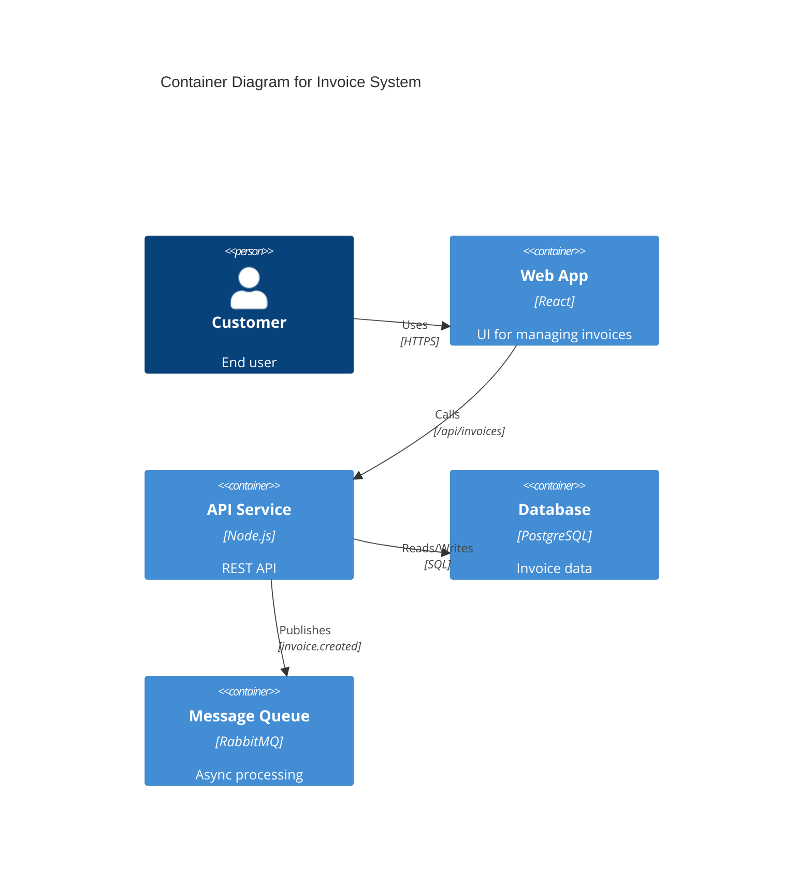

# C4 Diagram-to-Entities Scaffolding Feature

**Created**: 2025-10-27  
**Status**: 🎯 Specification Phase  
**Goal**: Enable users to visually design C4 architecture diagrams and automatically scaffold constitution, specs, features, user stories, and tasks

---

## Executive Summary

This feature enables an **architecture-first development workflow** where users:
1. **Design** system architecture using C4 diagrams (Context, Container, Component, Code)
2. **Scaffold** complete entity structures (constitution → features → stories → tasks)
3. **Trace** implementation back to architectural decisions
4. **Maintain** bidirectional sync between architecture and implementation

This creates a **visual specification-driven development (SDD)** workflow that complements the existing text-based Speckit workflow.

---

## User Flow

### Step 1: Create/Edit C4 Diagram
```
User opens "C4 Architect" wizard
  ↓
User selects diagram type (C1/C2/C3/C4)
  ↓
User builds diagram visually OR edits Mermaid code
  ↓
Diagram validates against C4 schema
  ↓
Diagram saves to context-repo/c4/
```

###

 Step 2: Analyze & Extract
```
User clicks "Scaffold Entities" button
  ↓
System analyzes diagram structure:
  - Nodes (systems, containers, components)
  - Relationships (API calls, events, data flows)
  - Technology stack annotations
  ↓
System generates scaffolding preview
```

### Step 3: Configure Scaffolding
```
User reviews proposed entities:
  ✓ Constitution (governance from system boundaries)
  ✓ Feature per container/component
  ✓ User stories from relationships
  ✓ Tasks from technical requirements
  ↓
User customizes entity generation options
  ↓
User confirms scaffolding
```

### Step 4: Generate Entities
```
System creates YAML entities:
  - constitution.yaml (architectural governance)
  - FEAT-XXX.yaml files (one per component)
  - US-XXX.yaml files (capability stories)
  - T-XXXX.yaml files (implementation tasks)
  ↓
Entities link back to C4 diagram
  ↓
Git branch created (optional)
```

---

## Architecture

### Component Structure

```
app/src/renderer/components/
  └─ C4DiagramEditor.vue         (NEW - Visual C4 editor)
  └─ C4DiagramRenderer.vue        (EXISTING - View mode)
  └─ C4ScaffoldWizard.vue         (NEW - Scaffolding wizard)

app/src/main/services/
  └─ C4AnalyzerService.ts         (NEW - Parse diagram structure)
  └─ C4ScaffoldingService.ts      (NEW - Generate entities)
  └─ SpeckitService.ts            (EXISTING - Reuse patterns)
  └─ ContextBuilderService.ts     (EXISTING - Reuse scaffolding)

context-repo/.context/pipelines/
  └─ c4-analyze.mjs               (NEW - Diagram analysis pipeline)
  └─ c4-scaffold.mjs              (NEW - Entity generation pipeline)
  └─ c4-validate.mjs              (EXISTING - Validation)
```

### Data Flow



---

## C4 Diagram Analysis

### Input: C4 Diagram (Mermaid)


### Output: Analysis JSON
```json
{
  "system": "InvoiceSystem",
  "level": "C2",
  "feature": "FEAT-001",
  "nodes": [
    {
      "id": "web",
      "name": "Web App",
      "kind": "container",
      "tech": "React",
      "description": "UI for managing invoices"
    },
    {
      "id": "api",
      "name": "API Service",
      "kind": "container",
      "tech": "Node.js",
      "description": "REST API"
    },
    {
      "id": "db",
      "name": "Database",
      "kind": "datastore",
      "tech": "PostgreSQL"
    },
    {
      "id": "queue",
      "name": "Message Queue",
      "kind": "queue",
      "tech": "RabbitMQ"
    }
  ],
  "relationships": [
    {
      "source": "web",
      "target": "api",
      "description": "Calls",
      "restPath": "/api/invoices"
    },
    {
      "source": "api",
      "target": "queue",
      "description": "Publishes",
      "emit": ["invoice.created"]
    }
  ]
}
```

---

## Entity Scaffolding Strategy

### 1. Constitution (Governance Layer)

**Generated from**: System-level C4 diagrams (C1)

```yaml
# CONST-INVOICE-SYSTEM.yaml
id: CONST-INVOICE-SYSTEM
title: Invoice System Constitutional Governance
domain: billing
status: active

principles:
  - title: "Architectural Boundaries"
    description: "Derived from C4 Context diagram"
    rules:
      - "Web App communicates only via REST API"
      - "No direct database access from frontend"
      - "Async processing via message queue"

technicalStack:
  frontend: React
  backend: Node.js
  database: PostgreSQL
  messaging: RabbitMQ

relatedDiagrams:
  - c4/invoice-system.md

constraints:
  - "All API endpoints must be RESTful"
  - "Database transactions must be ACID-compliant"
```

**Mapping Rules:**
- System boundaries → Architectural principles
- External systems → Integration constraints
- Technology choices → Technical stack documentation

### 2. Features (Container/Component Layer)

**Generated from**: C2 (Container) and C3 (Component) diagrams

```yaml
# FEAT-002-invoice-api-service.yaml
id: FEAT-002
title: Invoice API Service
domain: billing
status: planning
c4Reference: c4/invoice-system.md#api

description: |
  REST API service for invoice management operations.
  Handles CRUD operations, validation, and event publishing.

technicalDesign:
  technology: Node.js
  deployment: Container (Docker)
  database: PostgreSQL
  messaging: RabbitMQ

capabilities:
  - "Create invoices"
  - "Retrieve invoice by ID"
  - "Update invoice status"
  - "Delete invoices"
  - "Publish invoice events"

apiEndpoints:
  - path: /api/invoices
    method: POST
    description: Create new invoice
  - path: /api/invoices/:id
    method: GET
    description: Get invoice by ID

events:
  emits:
    - invoice.created
    - invoice.updated
  consumes: []

relatedComponents:
  - FEAT-001  # Web App
  - FEAT-003  # Database

userStories:
  - US-005
  - US-006
  - US-007
```

**Mapping Rules:**
- Each container → One feature
- Each significant component → One feature
- Relationships → Dependencies between features
- REST paths → API endpoint documentation
- Events → Event emission/consumption specs

### 3. User Stories (Relationship Layer)

**Generated from**: Relationships between C4 nodes

```yaml
# US-005-api-create-invoice.yaml
id: US-005
feature: FEAT-002
title: API endpoint to create invoices
c4Reference: c4/invoice-system.md#rel-web-api

asA: "Frontend developer"
iWant: "A POST /api/invoices endpoint"
soThat: "Users can create new invoices through the web interface"

acceptanceCriteria:
  - "Endpoint accepts invoice data as JSON"
  - "Returns 201 Created with invoice ID"
  - "Validates required fields"
  - "Publishes invoice.created event"
  - "Returns 400 for invalid data"

technicalContext:
  restPath: /api/invoices
  method: POST
  requestBody: InvoiceCreateDTO
  responseBody: InvoiceResponseDTO

relatedTasks:
  - T-0012  # Implement POST /api/invoices
  - T-0013  # Add invoice validation
  - T-0014  # Publish invoice.created event
```

**Mapping Rules:**
- Each relationship → One or more user stories
- REST API calls → API endpoint stories
- Event emissions → Event handling stories
- Data flows → Data transformation stories

### 4. Tasks (Implementation Layer)

**Generated from**: Technical requirements inferred from diagram

```yaml
# T-0012-implement-post-invoices.yaml
id: T-0012
title: Implement POST /api/invoices endpoint
feature: FEAT-002
userStory: US-005
status: todo
c4Reference: c4/invoice-system.md#api

description: |
  Create REST endpoint for invoice creation.
  Includes validation, database persistence, and event publishing.

technicalRequirements:
  - "Set up Express route handler"
  - "Implement request validation with Joi"
  - "Create InvoiceRepository.create() method"
  - "Publish invoice.created to RabbitMQ"
  - "Add unit tests (>80% coverage)"
  - "Add integration tests"

acceptanceCriteria:
  - "Endpoint returns 201 with invoice ID"
  - "Invalid requests return 400 with error details"
  - "Database record created successfully"
  - "Event published to queue"

estimatedHours: 8
techStack: Node.js, Express, PostgreSQL, RabbitMQ
```

**Mapping Rules:**
- Each capability → Implementation tasks
- Technology annotations → Technical requirements
- API endpoints → Endpoint implementation tasks
- Events → Event handler tasks
- Datastores → Repository/DAO tasks

---

## Pipeline Implementation

### Pipeline 1: `c4-analyze.mjs`

**Purpose**: Parse C4 diagram and extract structured information

```javascript
// context-repo/.context/pipelines/c4-analyze.mjs
import { readFile } from 'node:fs/promises';

/**
 * Analyze a C4 diagram and extract nodes, relationships, metadata
 * 
 * Usage:
 *   node c4-analyze.mjs <diagram-file>
 * 
 * Output: JSON structure with nodes, relationships, metadata
 */
export async function analyzeC4Diagram(diagramPath) {
  const content = await readFile(diagramPath, 'utf-8');
  
  // Extract metadata from comment header
  const metadata = extractMetadata(content);
  
  // Parse Mermaid C4 syntax
  const nodes = extractNodes(content);
  const relationships = extractRelationships(content);
  
  // Infer technical requirements
  const capabilities = inferCapabilities(nodes, relationships);
  const apiEndpoints = extractApiEndpoints(relationships);
  const events = extractEvents(relationships);
  
  return {
    metadata,
    nodes,
    relationships,
    capabilities,
    apiEndpoints,
    events,
    scaffoldingPlan: generateScaffoldingPlan(nodes, relationships)
  };
}

function generateScaffoldingPlan(nodes, relationships) {
  return {
    constitution: {
      id: `CONST-${sanitize(metadata.system)}`,
      principles: derivePrinciples(nodes, relationships),
      constraints: deriveConstraints(relationships)
    },
    features: nodes
      .filter(n => n.kind === 'container' || n.kind === 'component')
      .map(node => ({
        id: `FEAT-${nextId()}`,
        title: node.name,
        tech: node.tech,
        capabilities: inferNodeCapabilities(node, relationships)
      })),
    stories: relationships.map(rel => ({
      id: `US-${nextId()}`,
      title: `${rel.source} ${rel.description} ${rel.target}`,
      apiPath: rel.restPath,
      events: rel.emit || rel.consume
    })),
    tasks: [] // Generated from stories after confirmation
  };
}
```

### Pipeline 2: `c4-scaffold.mjs`

**Purpose**: Generate YAML entity files from scaffolding plan

```javascript
// context-repo/.context/pipelines/c4-scaffold.mjs
import { writeFile, mkdir } from 'node:fs/promises';
import { stringify as stringifyYAML } from 'yaml';

/**
 * Generate YAML entity files from C4 scaffolding plan
 * 
 * Usage:
 *   node c4-scaffold.mjs <analysis-json> <options>
 * 
 * Options:
 *   --constitution  Generate constitution file
 *   --features      Generate feature files
 *   --stories       Generate user story files
 *   --tasks         Generate task files
 */
export async function scaffoldEntities(analysisData, options) {
  const results = {
    created: [],
    skipped: [],
    errors: []
  };
  
  if (options.constitution) {
    await generateConstitution(analysisData.constitution, results);
  }
  
  if (options.features) {
    for (const feature of analysisData.features) {
      await generateFeature(feature, results);
    }
  }
  
  if (options.stories) {
    for (const story of analysisData.stories) {
      await generateUserStory(story, results);
    }
  }
  
  if (options.tasks) {
    for (const task of analysisData.tasks) {
      await generateTask(task, results);
    }
  }
  
  return results;
}

async function generateFeature(featureData, results) {
  const yaml = stringifyYAML({
    id: featureData.id,
    title: featureData.title,
    domain: featureData.domain || 'general',
    status: 'planning',
    c4Reference: featureData.c4Reference,
    technicalDesign: {
      technology: featureData.tech,
      deployment: 'Container'
    },
    capabilities: featureData.capabilities,
    apiEndpoints: featureData.apiEndpoints,
    events: featureData.events,
    userStories: featureData.stories.map(s => s.id)
  });
  
  const filename = `${featureData.id}-${sanitize(featureData.title)}.yaml`;
  const filePath = path.join('contexts', 'features', filename);
  
  await writeFile(filePath, yaml, 'utf-8');
  results.created.push(filePath);
}
```

---

## UI Components

### C4ScaffoldWizard.vue

**Location**: `app/src/renderer/components/C4ScaffoldWizard.vue`

**Steps**:

1. **Select Diagram**
   - List all C4 diagrams in repo
   - Show diagram preview
   - Display metadata (system, level, existing entities)

2. **Review Analysis**
   - Show parsed nodes, relationships
   - Display proposed entity structure
   - Highlight: X features, Y stories, Z tasks to create

3. **Configure Options**
   - ☑ Generate constitution (if C1 diagram)
   - ☑ Generate features (from containers/components)
   - ☑ Generate user stories (from relationships)
   - ☑ Generate tasks (from technical requirements)
   - [ ] Create Git branch
   - [ ] Auto-commit changes

4. **Preview Entities**
   - Tree view of entities to be created
   - Click to view YAML preview
   - Edit before generation

5. **Generate**
   - Progress indicator
   - List of created files
   - Link to view in Context Tree
   - Option to run validation

### C4DiagramEditor.vue (Future Enhancement)

**Location**: `app/src/renderer/components/C4DiagramEditor.vue`

**Features**:
- Visual drag-and-drop C4 editor
- Node palette (Person, System, Container, Component, etc.)
- Relationship drawing
- Property panels for nodes/relationships
- Live Mermaid preview
- Export to Mermaid markdown

**Libraries to Consider**:
- **mermaid-editor** - Existing Mermaid editor
- **Excalidraw** - Visual diagramming (custom C4 shapes)
- **React Flow** - Node-based editor (with C4 node types)

---

## Service Layer

### C4AnalyzerService.ts

```typescript
export class C4AnalyzerService {
  /**
   * Analyze a C4 diagram file and return structured data
   */
  async analyze(diagramPath: string): Promise<C4Analysis> {
    // Read diagram file
    // Parse Mermaid syntax
    // Extract nodes, relationships, metadata
    // Generate scaffolding plan
    return {
      metadata: { system, level, feature },
      nodes: [...],
      relationships: [...],
      scaffoldingPlan: {...}
    };
  }
  
  /**
   * Validate that diagram is suitable for scaffolding
   */
  async validateForScaffolding(analysis: C4Analysis): Promise<ValidationResult> {
    const errors = [];
    const warnings = [];
    
    // Check for required metadata
    if (!analysis.metadata.system) {
      errors.push('System name required in c4 header');
    }
    
    // Check for minimum nodes
    if (analysis.nodes.length < 2) {
      warnings.push('Diagram has very few nodes');
    }
    
    // Check for relationships
    if (analysis.relationships.length === 0) {
      warnings.push('No relationships found - limited scaffolding possible');
    }
    
    return { valid: errors.length === 0, errors, warnings };
  }
}
```

### C4ScaffoldingService.ts

```typescript
export class C4ScaffoldingService {
  /**
   * Generate entity files from scaffolding plan
   */
  async scaffold(
    repoPath: string,
    plan: ScaffoldingPlan,
    options: ScaffoldOptions
  ): Promise<ScaffoldResult> {
    const results = {
      created: [],
      errors: []
    };
    
    // Execute c4-scaffold.mjs pipeline
    const args = [
      path.join(repoPath, '.context', 'pipelines', 'c4-scaffold.mjs'),
      JSON.stringify(plan),
      ...buildOptionsArgs(options)
    ];
    
    const { stdout } = await execa('node', args, { cwd: repoPath });
    const pipelineResult = JSON.parse(stdout);
    
    return {
      created: pipelineResult.created,
      errors: pipelineResult.errors
    };
  }
  
  /**
   * Preview entities without creating files
   */
  async preview(plan: ScaffoldingPlan): Promise<EntityPreview[]> {
    // Generate YAML content without writing files
    return plan.features.map(f => ({
      type: 'feature',
      id: f.id,
      filename: `${f.id}-${sanitize(f.title)}.yaml`,
      yamlContent: generateFeatureYAML(f)
    }));
  }
}
```

---

## Integration Points

### 1. Context Tree Integration
- C4 diagrams appear in tree under "C4 Diagrams" section
- Right-click menu: "Scaffold Entities from Diagram"
- Generated entities show C4 reference badge

### 2. Speckit Integration
- C4 scaffolding workflow complements Speckit workflow
- Architecture-first: C4 → Entities
- Specification-first: Speckit → Entities
- Both create compatible YAML structures

### 3. ContextBuilder Integration
- Reuse entity creation patterns
- Reuse YAML generation utilities
- Reuse validation logic
- Similar wizard UI patterns

### 4. Graph View Integration
- Show C4 diagram nodes in dependency graph
- Visualize entity-to-diagram traceability
- Highlight components without implementations

---

## Implementation Phases

### Phase 1: Foundation (Week 1-2)
**Goal**: Basic analysis and manual scaffolding

- [ ] Create `C4AnalyzerService.ts`
- [ ] Implement `c4-analyze.mjs` pipeline
- [ ] Add IPC handlers for C4 analysis
- [ ] Create basic scaffolding templates
- [ ] Unit tests for analyzer

**Deliverable**: CLI-based C4 analysis working

### Phase 2: Automated Scaffolding (Week 3-4)
**Goal**: Full entity generation

- [ ] Implement `C4ScaffoldingService.ts`
- [ ] Create `c4-scaffold.mjs` pipeline
- [ ] Add constitution generation logic
- [ ] Add feature generation from containers
- [ ] Add user story generation from relationships
- [ ] Add task generation from requirements
- [ ] Integration tests

**Deliverable**: Complete scaffolding pipeline working

### Phase 3: UI Wizard (Week 5-6)
**Goal**: User-friendly wizard interface

- [ ] Create `C4ScaffoldWizard.vue`
- [ ] Implement step-by-step wizard flow
- [ ] Add entity preview functionality
- [ ] Add configuration options
- [ ] Add progress tracking
- [ ] Connect to Context Tree

**Deliverable**: Full wizard UI integrated

### Phase 4: Editor (Week 7-8) - OPTIONAL
**Goal**: Visual C4 diagram editor

- [ ] Research editor libraries
- [ ] Create `C4DiagramEditor.vue`
- [ ] Implement node palette
- [ ] Implement relationship drawing
- [ ] Implement property panels
- [ ] Export to Mermaid

**Deliverable**: Visual C4 editor (stretch goal)

---

## Testing Strategy

### Unit Tests
- C4AnalyzerService parsing logic
- Entity generation templates
- YAML structure validation

### Integration Tests
- Full pipeline execution (analyze → scaffold)
- Entity file creation
- Git operations (branch, commit)

### E2E Tests
- Wizard flow (select diagram → generate entities)
- Verify created entities in tree
- Validate generated YAML

---

## Success Metrics

### Functional
- ✅ Can analyze any valid C4 diagram
- ✅ Generates valid YAML entities
- ✅ Entities pass schema validation
- ✅ Bidirectional traceability (diagram ↔ entities)

### Performance
- Analysis completes in <2 seconds
- Scaffolding 50 entities in <5 seconds
- Wizard load time <1 second

### User Experience
- < 5 clicks to scaffold from diagram
- Clear preview before generation
- Inline help and tooltips
- Undo/rollback option

---

## Risks & Mitigation

### Risk 1: Complex C4 Syntax Parsing
**Mitigation**: 
- Use existing Mermaid parser libraries
- Support subset of C4 syntax initially
- Clear error messages for unsupported syntax

### Risk 2: Entity Naming Conflicts
**Mitigation**:
- Check for existing entity IDs before generation
- Offer auto-increment or manual ID entry
- Preview shows conflicts before creation

### Risk 3: Overwhelming Entity Count
**Mitigation**:
- Allow selective scaffolding (features only, stories only, etc.)
- Batch creation in background
- Progress indicator with cancel option

### Risk 4: Diagram-Entity Drift
**Mitigation**:
- Store C4 reference in all entities
- Add "Sync from Diagram" option
- Validation warnings for orphaned entities

---

## Future Enhancements

### 1. Bidirectional Sync
- Detect changes in entities
- Update C4 diagram automatically
- Conflict resolution UI

### 2. Visual Diagram Editor
- Drag-and-drop C4 components
- Real-time Mermaid code generation
- Templates for common patterns

### 3. AI-Assisted Design
- AI suggests architecture from requirements
- Generate C4 diagrams from text description
- Optimize architecture based on best practices

### 4. Impact Analysis
- Show which entities affected by diagram changes
- Highlight outdated implementations
- Suggest refactoring tasks

---

## References

- [C4 Model](https://c4model.com/)
- [Mermaid C4 Diagrams](https://mermaid.js.org/syntax/c4.html)
- [Existing Speckit Workflow](./SPECKIT_WORKFLOW.md)
- [Context Builder Service](../app/src/main/services/ContextBuilderService.ts)
- [CODE_SPLITTING_PLAN.md](./CODE_SPLITTING_PLAN.md)

---

**Next Steps:**
1. Review this specification with team
2. Create GitHub issues for Phase 1 tasks
3. Set up development branch: `feature/c4-scaffolding`
4. Begin implementation of C4AnalyzerService
