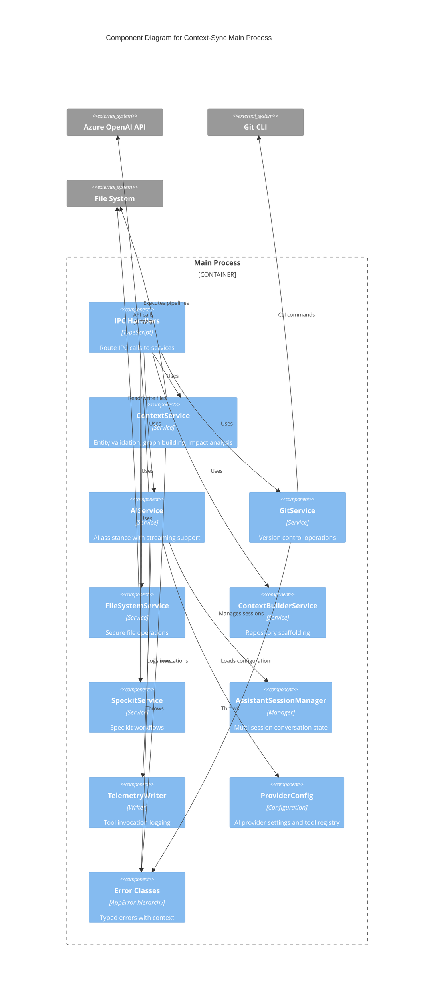

# Context-Sync Architecture - C4 Component Diagram

## Main Process - Service Layer Components



---

## Component Details

### IPC Handlers
**Location**: `src/main/ipc/handlers/`  
**Responsibilities**:
- Register IPC channels with Electron
- Parse and validate IPC payloads
- Route requests to appropriate services
- Transform service responses for renderer
- Handle errors and send error payloads

**Handler Groups**:
- `repos.handlers.ts`: Repository management
- `git.handlers.ts`: Git operations
- `assistant.handlers.ts`: AI assistance
- `context.handlers.ts`: Entity operations
- `settings.handlers.ts`: Configuration
- `credentials.handlers.ts`: Secure storage

**Example Flow**:
```typescript
ipcMain.handle('repos:validate', async (_event, { dir }) => {
  try {
    const service = new ContextService(dir);
    const result = await service.validate();
    return { ok: true, result };
  } catch (error) {
    return { ok: false, error: error.message };
  }
});
```

---

### ContextService
**File**: `src/main/services/ContextService.ts`  
**Purpose**: Core context repository operations

**Methods**:
- `validate()`: Run validation pipeline, return errors
- `buildGraph()`: Execute graph-building pipeline
- `calculateImpact(changedIds)`: Analyze ripple effects
- `generate(ids)`: Generate content for entities

**Pipeline Integration**:
- Executes `.context/pipelines/*.mjs` scripts
- Passes base64-encoded parameters (Windows-safe)
- Parses JSON stdout
- Returns structured results

**Performance**:
- All methods instrumented with `performance.mark/measure`
- Logs duration and entity counts
- Example: `Graph build completed in 1234.56ms`

---

### AIService
**File**: `src/main/services/AIService.ts`  
**Purpose**: AI assistance with multiple providers

**Key Features**:
- **Provider Support**: Azure OpenAI, Ollama
- **Streaming**: Real-time token delivery via child processes
- **Timeout Protection**: 5-minute auto-timeout for hung streams
- **Credential Security**: Encrypted API key storage
- **Telemetry**: All interactions logged for debugging

**Methods**:
- `assist(options)`: Non-streaming AI query
- `startAssistStream(options)`: Streaming with callbacks
- `cancelAssistStream(streamId)`: Terminate active stream
- `applyEdit(options)`: Apply AI-suggested file edits with YAML validation
- `getConfig(dir)`: Load AI configuration from repo
- `getCredentials(provider)`: Decrypt and retrieve API key

**Stream Management**:
```typescript
const streamId = await aiService.startAssistStream({
  question: "What does FEAT-001 do?",
  onData: (chunk) => { /* handle token */ },
  onEnd: () => { /* cleanup */ },
  onError: (err) => { /* handle error */ }
});

// Cleanup tracked in memory:
// - streamProcesses: Map<streamId, ChildProcess>
// - streamTimeouts: Map<streamId, NodeJS.Timeout>
```

**Performance Monitoring**:
- Per-stream performance tracking
- Chunk count and duration logged
- Cleanup after stream completes

---

### GitService
**File**: `src/main/services/GitService.ts`  
**Purpose**: Version control integration

**Methods**:
- `getStatus()`: Current repository state
- `getDiff(filePath?)`: File or full repository diff
- `commit(message, files?)`: Stage and commit changes
- `getBranches()`: List all branches
- `createBranch(name)`: Create new branch
- `push()`: Push to remote
- `pull()`: Pull from remote

**Path Normalization**:
- Handles Windows backslashes → forward slashes
- Strips repo root prefix
- Supports relative and absolute paths
- Example: `context-repo\FEAT-001.yaml` → `FEAT-001.yaml`

**Performance**:
- All operations measured with Performance API
- Logs duration and affected file counts

---

### FileSystemService
**File**: `src/main/services/FileSystemService.ts`  
**Purpose**: Secure file operations with validation

**Security Features**:
- **Path Traversal Prevention**: Rejects `..` sequences
- **Boundary Checks**: Ensures files are within repo
- **YAML Validation**: Parses before write
- **Error Context**: Detailed error messages

**Methods**:
- `readFile(repoPath, relativePath)`: Safe read
- `writeFile(repoPath, relativePath, content)`: Safe write with validation
- `listFiles(repoPath, pattern?)`: Directory listing

---

### ContextBuilderService
**File**: `src/main/services/ContextBuilderService.ts`  
**Purpose**: Repository scaffolding and entity creation

**Methods**:
- `scaffoldNewRepo(options)`: Create full repo structure
- `getSuggestions(options)`: Run context-builder pipeline
- `getTemplates(options)`: List available entity templates
- `createEntity(options)`: Create entity from template

**Template Resolution**:
- Development: `../../context-repo-template`
- Production: `resources/app.asar.unpacked/context-repo-template`
- Fallback: Embedded minimal template

---

### SpeckitService
**File**: `src/main/services/SpeckitService.ts`  
**Purpose**: Speckit-specific workflows

**Methods**:
- `listSpeckits(repoPath)`: Find all spec kit files
- `getStaleSpeckits(repoPath, days)`: Find outdated specs
- `executeSpeckitPipeline(repoPath, pipeline, args)`: Run pipeline

**Stale Detection**:
- Configurable threshold (default: 7 days)
- Extracted as constant: `SPECKIT_STALE_THRESHOLD_DAYS`

---

### AssistantSessionManager
**File**: `src/main/services/assistantSessionManager.ts`  
**Purpose**: Manage multi-session AI conversations

**Session Lifecycle**:
- `createSession(options)`: Initialize with provider and tools
- `getSession(sessionId)`: Retrieve session state
- `updateSession(sessionId, updater)`: Modify session
- `appendUserTurn(sessionId, payload)`: Add user message
- `appendAssistantResponse(sessionId, payload)`: Add AI response

**State**:
```typescript
interface AssistantSession {
  id: string;
  provider: 'azure-openai' | 'ollama';
  systemPrompt: string;
  messages: ConversationTurn[];
  activeTools: ToolDescriptor[];
  pendingApprovals: PendingAction[];
  telemetryId: string;
  createdAt: string;
  updatedAt: string;
}
```

**Tool Resolution**:
- Filters provider-allowed tools
- Validates requested tools exist
- Throws if no valid tools remain

---

### TelemetryWriter
**File**: `src/main/services/telemetryWriter.ts`  
**Purpose**: Track tool invocations for debugging

**Methods**:
- `start(sessionId, toolId, parameters)`: Begin invocation
- `finish(recordId, result)`: Mark complete
- `getRecordsForSession(sessionId)`: Retrieve all records
- `recordApproval(sessionId, actionId, outcome)`: Log approval decision

**Storage**:
- One JSON file per session: `~/context-sync/logs/<sessionId>.json`
- In-memory cache for active sessions
- Lazy hydration from disk

**Record Structure**:
```typescript
interface ToolInvocationRecord {
  id: string;
  sessionId: string;
  toolId: string;
  status: 'succeeded' | 'failed' | 'aborted';
  parameters: Record<string, unknown>;
  resultSummary?: string;
  startedAt: string;
  finishedAt?: string;
  provider: AssistantProvider;
  metadata?: Record<string, unknown>;
}
```

---

### ProviderConfig
**File**: `src/main/services/providerConfig.ts`  
**Purpose**: AI provider configuration and tool registry

**Tool Descriptors**:
```typescript
const BASE_TOOLS: ToolDescriptor[] = [
  {
    id: 'context.read',
    name: 'Read Context File',
    allowedProviders: ['azure-openai', 'ollama'],
    inputSchema: { /* JSON Schema */ },
    outputSchema: { /* JSON Schema */ }
  },
  // ... more tools
];
```

**Environment-Driven**:
- Tools enabled/disabled via env vars: `DISABLE_TOOL_<toolId>=true`
- Provider settings from env: `AZURE_OPENAI_ENDPOINT`, `OLLAMA_URL`
- Deployment-specific configuration

**Configuration Loading**:
```typescript
const config = loadProviderConfiguration();
// Returns:
{
  providers: {
    'azure-openai': { endpoint, deployment, tools, ... },
    'ollama': { endpoint, model, tools, ... }
  },
  disabledTools: { toolId: [providers] }
}
```

---

### Error Handling
**File**: `src/main/errors/AppError.ts`  
**Purpose**: Typed error hierarchy with context

**Error Classes**:
- `AppError`: Base class
- `ValidationError`: Bad input or state
- `PipelineError`: Pipeline execution failure
- `GitError`: Git operation failure
- `AIError`: AI provider errors

**Error Context**:
```typescript
throw new PipelineError(
  'Validation pipeline not found',
  'validate',
  { pipelinePath: '/path/to/validate.mjs' }
);
```

**Benefits**:
- Type-safe error handling
- Rich context for debugging
- Structured error responses to renderer

---

## Data Flow Example: AI Assistance

1. **User asks question in UI**
   - Renderer: `assistantStore.sendMessage()`
   - IPC: `assistant:sendMessage`

2. **Main process receives request**
   - Handler: `assistant.handlers.ts`
   - Validates session exists

3. **Session manager appends user turn**
   - `sessionManager.appendUserTurn()`
   - Conversation history updated

4. **AI service calls provider**
   - `aiService.assist()` or `aiService.startAssistStream()`
   - Executes `.context/pipelines/ai-assistant.mjs`
   - Passes encrypted API key

5. **Pipeline calls Azure OpenAI**
   - Child process with stdout streaming
   - JSON chunks emitted per token

6. **Response flows back**
   - Main: Parse JSON from stdout
   - IPC: Broadcast `assistant:stream-event`
   - Renderer: Update UI in real-time

7. **Telemetry logged**
   - `telemetryWriter.start()` → `finish()`
   - Performance metrics captured
   - Session file updated

---

## Performance Monitoring

All critical operations instrumented:

```typescript
// ContextService
performance.mark('context-validate-start');
// ... operation ...
performance.mark('context-validate-end');
performance.measure('context-validate', 'context-validate-start', 'context-validate-end');
const measure = performance.getEntriesByName('context-validate')[0];
console.debug(`Validation completed in ${measure.duration}ms`);
```

**Instrumented Operations**:
- Context validation
- Graph building
- Impact analysis
- Git status/diff/commit
- AI streaming (per-stream tracking)

---

**Related**: See [C4 Context](./c4-context.md) and [C4 Container](./c4-container.md) diagrams
