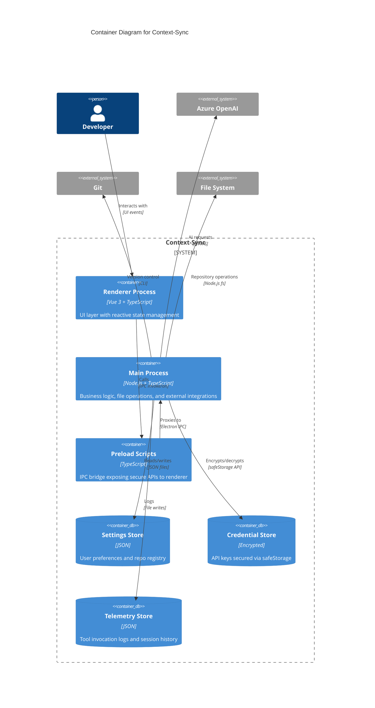

# Context-Sync Architecture - C4 Container Diagram

## Container Architecture



## Containers

### Renderer Process
**Technology**: Vue 3, Pinia, TypeScript, Vite  
**Responsibilities**:
- Vue.js-based UI components (Material Design 3)
- Pinia stores for reactive state management
- IPC communication via preload bridge
- Client-side routing with Vue Router
- D3.js graph visualization
- Real-time AI stream handling

**Key Stores**:
- `contextStore`: Entity graph, active repo, file watching
- `assistantStore`: AI sessions, conversation history, pending approvals
- `gitStore`: Repository status, diffs, commit history
- `impactStore`: Change tracking, impact analysis results
- `snackbarStore`: Toast notifications

**Pages**:
- Developer Hub (dashboard)
- Graph Visualizer
- Git Panel
- C4 Diagram Builder
- Entity Builder
- Diff Viewer

---

### Main Process
**Technology**: Node.js, TypeScript, Electron  
**Responsibilities**:
- IPC handler registration and routing
- Business logic services
- File system operations with security validation
- External API integration (Azure OpenAI, Ollama)
- Git operations via `simple-git`
- Pipeline execution (Node.js child processes)
- Credential management
- Telemetry writing

**Core Services**:
- `ContextService`: Entity validation, graph building, impact analysis
- `AIService`: AI assistance, streaming, provider configuration
- `GitService`: Status, diff, commit, branch operations
- `FileSystemService`: Safe file read/write with path validation
- `ContextBuilderService`: Repository scaffolding, template management
- `SpeckitService`: Spec kit operations
- `AssistantSessionManager`: Multi-session AI conversation management
- `TelemetryWriter`: Tool invocation logging

**IPC Handlers**:
- `repos.*`: Repository selection, validation, file watching
- `git.*`: Version control operations
- `assistant.*`: AI session management, tool execution
- `context.*`: Entity operations, graph queries
- `settings.*`: User preferences persistence
- `credentials.*`: Secure credential storage/retrieval

---

### Preload Scripts
**Technology**: TypeScript, Electron contextBridge  
**Responsibilities**:
- Expose secure IPC APIs to renderer
- Type-safe bridge interfaces
- Event listener management
- Prevent direct Node.js API access (security)

**Bridges**:
- `window.api.repos`: Repository management
- `window.api.git`: Git operations
- `window.api.assistant`: AI assistance
- `window.api.settings`: Configuration
- `window.api.credentials`: Secure storage
- `window.api.app`: Application utilities

---

### Settings Store
**Format**: JSON  
**Location**: `~/.config/context-sync/settings.json` (OS-specific)  
**Contents**:
- Active repository path
- Repository registry (id, label, path, lastUsed)
- User preferences
- Feature flags

---

### Credential Store
**Format**: Encrypted binary (Electron safeStorage)  
**Location**: OS-specific secure storage  
**Contents**:
- Azure OpenAI API key
- Other provider credentials
- Encrypted at rest, decrypted in-memory only

---

### Telemetry Store
**Format**: JSON per session  
**Location**: `~/context-sync/logs/<sessionId>.json`  
**Contents**:
- Tool invocation records
- Timestamps (start/finish)
- Parameters and results
- Performance metrics
- No PII or sensitive data

---

## Communication Patterns

### IPC Flow
```
Renderer (Vue Component)
    ↓
Pinia Store (async action)
    ↓
Preload Bridge (window.api.*)
    ↓
Electron IPC (contextBridge)
    ↓
Main Process IPC Handler
    ↓
Service Layer (business logic)
    ↓
External System (FS, Git, AI)
```

### AI Streaming Flow
```
Renderer → assistant.startAssistStream()
    → Main Process spawns child process
    → Pipeline script calls Azure OpenAI API
    → stdout JSON chunks piped back
    → IPC events broadcast to renderer
    → UI updates in real-time
```

### File Watching Flow
```
Main Process → fs.watch() on repo directory
    → Debounced events (250ms)
    → IPC broadcast: repos:file-changed
    → Renderer receives event
    → contextStore.loadGraph() triggered
    → UI refreshes with updated graph
```

---

## Security Architecture

### Content Security Policy (Production)
```
default-src 'self';
script-src 'self';
style-src 'self' 'unsafe-inline';
img-src 'self' data:;
connect-src 'self';
```

### IPC Security
- **contextBridge**: Only whitelisted APIs exposed to renderer
- **No eval**: Strict CSP prevents code injection
- **Path Validation**: All file paths validated to prevent traversal
- **Credential Isolation**: API keys never exposed to renderer process

---

**Next**: See [C4 Component Diagram](./c4-component.md) for detailed service architecture
