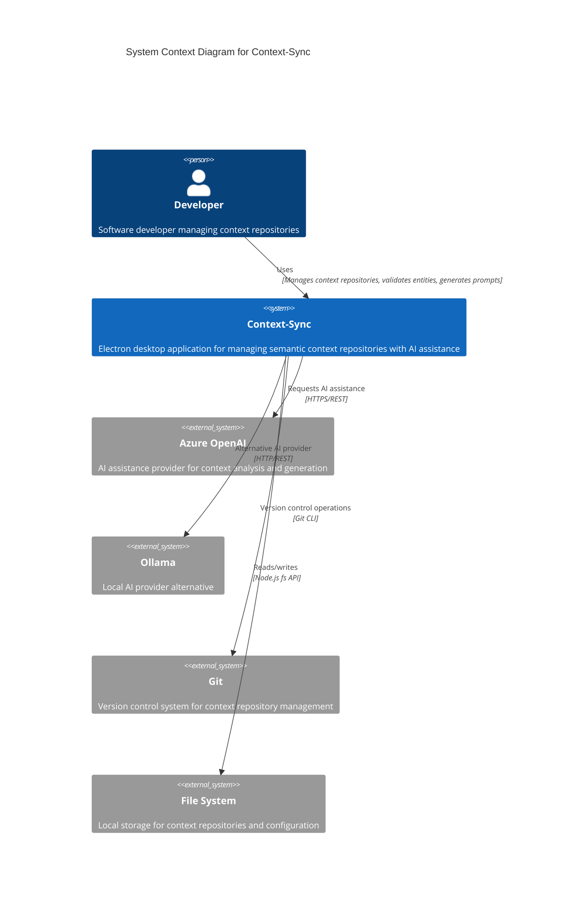

# Context-Sync Architecture - C4 Context Diagram

## System Context

## Description

**Context-Sync** is an Electron-based desktop application that helps developers manage semantic context repositories. It provides:

- **Entity Management**: Create, validate, and visualize context entities (features, user stories, tasks, governance)
- **Dependency Graph**: Build and visualize relationships between entities
- **Impact Analysis**: Track how changes propagate through the dependency graph
- **AI Assistance**: Get intelligent suggestions and analysis using Azure OpenAI or Ollama
- **Git Integration**: Commit, diff, and track repository changes
- **C4 Diagram Generation**: Visualize architecture using Context-Sync's own capabilities

## External Dependencies

### Azure OpenAI
- **Purpose**: Primary AI assistance provider
- **Protocol**: HTTPS REST API
- **Authentication**: API key via encrypted credential storage
- **Usage**: Context analysis, entity suggestions, prompt generation

### Ollama
- **Purpose**: Local AI alternative (privacy-focused)
- **Protocol**: HTTP REST API
- **Endpoint**: Default `http://localhost:11434`
- **Usage**: Same AI capabilities without external service dependency

### Git
- **Purpose**: Version control for context repositories
- **Integration**: Via `simple-git` library
- **Operations**: Status, diff, commit, branch management

### File System
- **Purpose**: Store context repositories, configuration, telemetry
- **Locations**:
  - Context repositories: User-specified directories
  - Settings: OS-specific app data directory
  - Logs: `~/context-sync/logs`
  - Credentials: Encrypted storage via `safeStorage`

## Security Boundaries

- **Credential Encryption**: All API keys encrypted using Electron's `safeStorage`
- **Path Validation**: Prevents directory traversal attacks
- **Content Security Policy**: Strict CSP in production builds
- **No External Analytics**: All telemetry stored locally

## Key User Workflows

1. **Repository Setup**
   - Developer creates/selects context repository
   - Context-Sync validates structure and entities
   - File watching enabled for auto-refresh

2. **Entity Lifecycle**
   - Create entities using builder templates
   - Validate against JSON schemas
   - Generate dependency graph
   - Analyze impact of changes

3. **AI-Assisted Development**
   - Ask questions about entities
   - Get improvement suggestions
   - Generate prompts for LLM workflows
   - Stream real-time AI responses

4. **Version Control Integration**
   - Review diffs before committing
   - Commit changes with validation
   - Track working tree status
   - Branch management

---

**Next**: See [C4 Container Diagram](./c4-container.md) for internal system architecture
