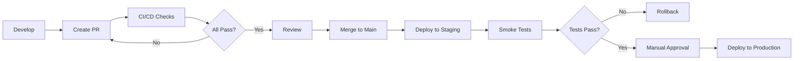

# CI/CD Pipeline Documentation

## Overview

This document describes the enterprise-grade CI/CD pipeline for the Context-Sync project. The pipeline is built using GitHub Actions and provides comprehensive automation for testing, security scanning, deployment, and quality assurance.

## Table of Contents

- [Workflows](#workflows)
- [Pipeline Architecture](#pipeline-architecture)
- [Configuration](#configuration)
- [Required Secrets](#required-secrets)
- [Environment Setup](#environment-setup)
- [Best Practices](#best-practices)
- [Troubleshooting](#troubleshooting)

## Workflows

### 1. CI Pipeline (`ci.yml`)

**Purpose**: Continuous Integration for pull requests and pushes to main/develop branches.

**Triggers**:
- Pull requests to `main` or `develop`
- Pushes to `main` or `develop`

**Jobs**:

#### Pre-checks
- Fast validation job that fails quickly
- Path filtering to skip unnecessary jobs
- Conventional commit format validation

#### Lint & Format
- ESLint validation
- Code formatting checks
- Runs on Ubuntu only

#### Type Check
- TypeScript compilation check
- Strict type checking
- Validates all type definitions

#### Unit Tests
- Cross-platform testing (Ubuntu, Windows, macOS)
- Coverage reporting to Codecov
- Parallel execution for faster feedback

#### E2E Tests
- End-to-end testing with Playwright
- Multi-platform support
- Artifact uploads for test reports

#### Build & Package
- Full application build
- Multi-platform packaging
- Build artifact generation

#### Bundle Analysis
- Bundle size tracking
- Performance analysis
- Only runs on PRs

**Duration**: ~15-30 minutes depending on changes

**Cost Estimate**: ~$0.50-1.00 per run (based on GitHub Actions pricing)

### 2. CD Pipeline (`cd.yml`)

**Purpose**: Continuous Deployment to staging and production environments.

**Triggers**:
- Manual workflow dispatch only
- Requires environment selection

**Jobs**:

#### Pre-deployment Checks
- Version determination
- Lint, typecheck, and test validation
- Approval gate for production

#### Deploy to Staging
- Automated deployment
- Smoke tests
- 30-day artifact retention

#### Deploy to Production
- Manual approval required
- Backup creation
- Deployment tagging
- 90-day artifact retention
- GitHub deployment tracking

#### Post-deployment
- Notification sending
- Metrics tracking
- Deployment reporting

#### Rollback
- Automatic on failure
- Backup restoration
- Notification alerts

**Duration**: ~20-45 minutes

**Cost Estimate**: ~$0.75-1.50 per deployment

### 3. Security Scanning (`security.yml`)

**Purpose**: Comprehensive security analysis and vulnerability detection.

**Triggers**:
- Push to main/develop
- Pull requests
- Daily schedule (2 AM UTC)
- Manual dispatch

**Jobs**:

#### Dependency Scan
- `pnpm audit` for vulnerabilities
- Severity classification (critical, high, medium, low)
- Automated PR comments
- Audit report artifacts

#### Secret Detection
- Gitleaks for exposed secrets
- TruffleHog for verified secrets
- Historical commit scanning

#### SAST - CodeQL
- Static analysis for JavaScript/TypeScript
- Security and quality queries
- SARIF upload to GitHub Security

#### SAST - Semgrep
- Pattern-based security scanning
- Multiple rulesets (security-audit, secrets, typescript, nodejs)
- SARIF reporting

#### License Compliance
- License checker for dependencies
- Whitelist validation (MIT, Apache-2.0, BSD variants, ISC, 0BSD)
- License report generation

#### Container Scan
- Trivy filesystem scanning
- Critical and high severity focus
- Skip on PRs (runs on main only)

#### OpenSSF Scorecard
- Open source security scoring
- Best practices validation
- Public results publishing

**Duration**: ~15-30 minutes

**Cost Estimate**: ~$0.40-0.80 per run

### 4. PR Automation (`pr-automation.yml`)

**Purpose**: Automated PR quality checks and workflow enhancements.

**Triggers**:
- PR opened, edited, synchronized, reopened
- Labels added/removed
- Issue comments

**Jobs**:

#### Auto Labeler
- Path-based labeling (app, context-repo, docs, ci/cd, tests)
- Size labeling (XS, S, M, L, XL)
- Type labeling from title (feature, bug, docs, etc.)

#### Auto Assignment
- Reviewer assignment based on changed files
- Configurable via `.github/auto-assign.yml`

#### PR Title Validation
- Conventional commit format enforcement
- Subject pattern validation
- Clear error messages

#### Size Check
- Warning for PRs >1000 lines
- Recommendations for splitting large PRs

#### Description Check
- Minimum description length (50 chars)
- Required sections validation
- PR template enforcement

#### Conflict Detection
- Automatic conflict labeling
- Resolution instructions
- Auto-removal when resolved

#### Dependency Change Detection
- Automatic labeling
- Security reminder checklist
- License compatibility check

#### Stale PR Management
- Mark inactive PRs (30 days)
- Auto-close after 7 more days
- Exempt WIP and blocked PRs

#### Metrics Tracking
- Lines added/deleted
- Files changed
- Commit count
- Review comments

**Duration**: ~5-10 minutes

**Cost Estimate**: ~$0.05-0.15 per run

### 5. Context Validation (`context-validate.yml`)

**Purpose**: Validate context repository entities and schemas.

**Triggers**:
- Changes to `context-repo/.context/**` or `context-repo/contexts/**`
- PR and push to main/develop

**Jobs**:
- C4 diagram validation
- YAML schema validation
- Dependency graph building
- Dangling reference checking

**Duration**: ~10-15 minutes

**Cost Estimate**: ~$0.20-0.40 per run

### 6. Impact Analysis (`impact-analysis.yml`)

**Purpose**: Analyze downstream effects of context changes.

**Triggers**:
- Changes to `context-repo/contexts/**`

**Jobs**:
- Changed entity detection
- Impact analysis execution
- PR comment with results
- Consistency rule checking

**Duration**: ~10-15 minutes

**Cost Estimate**: ~$0.20-0.40 per run

### 7. Release (`release.yml`)

**Purpose**: Create GitHub releases with multi-platform builds.

**Triggers**:
- Tags matching `v*.*.*`
- Manual workflow dispatch

**Jobs**:
- Release creation
- Windows build (Squirrel installer)
- macOS build (ZIP)
- Linux builds (DEB, RPM)
- Asset validation

**Duration**: ~30-60 minutes

**Cost Estimate**: ~$1.50-3.00 per release

## Pipeline Architecture

```
┌─────────────────────────────────────────────────────────┐
│                    GitHub Events                        │
│  (push, pull_request, schedule, workflow_dispatch)     │
└────────────────────┬────────────────────────────────────┘
                     │
         ┌───────────┴────────────┐
         │                        │
    ┌────▼─────┐          ┌──────▼──────┐
    │ CI Jobs  │          │  CD Jobs    │
    │          │          │             │
    │ • Lint   │          │ • Staging   │
    │ • Test   │          │ • Production│
    │ • Build  │          │ • Rollback  │
    └────┬─────┘          └──────┬──────┘
         │                       │
    ┌────▼─────────┐      ┌─────▼───────┐
    │ Security     │      │ PR Auto     │
    │              │      │             │
    │ • SAST       │      │ • Label     │
    │ • Deps       │      │ • Assign    │
    │ • Secrets    │      │ • Validate  │
    └──────────────┘      └─────────────┘
```

## Configuration

### Path Filters

Configure in workflows to skip unnecessary jobs:

```yaml
paths:
  - 'app/**'
  - 'context-repo/**'
  - '.github/workflows/**'
```

### Caching Strategy

Dependencies are cached to speed up builds:

```yaml
- uses: actions/cache@v4
  with:
    path: |
      ~/.pnpm-store
      app/node_modules
    key: ${{ runner.os }}-pnpm-${{ hashFiles('**/pnpm-lock.yaml') }}
```

### Concurrency Control

Prevent duplicate runs:

```yaml
concurrency:
  group: ${{ github.workflow }}-${{ github.ref }}
  cancel-in-progress: true
```

## Required Secrets

### GitHub Secrets

Configure these in **Settings → Secrets and variables → Actions**:

#### Optional Secrets

| Secret | Purpose | Where Used |
|--------|---------|------------|
| `CODECOV_TOKEN` | Code coverage reporting | CI Pipeline |
| `GITLEAKS_LICENSE` | Gitleaks Pro license | Security Scanning |
| `SLACK_WEBHOOK_URL` | Deployment notifications | CD Pipeline |
| `AWS_ACCESS_KEY_ID` | S3 deployment | CD Pipeline |
| `AWS_SECRET_ACCESS_KEY` | S3 deployment | CD Pipeline |

#### Built-in Secrets

These are automatically available:
- `GITHUB_TOKEN` - Provided by GitHub Actions

### Environment Secrets

Configure for protected environments:

#### Staging Environment
- `STAGING_DEPLOY_KEY`
- `STAGING_URL`

#### Production Environment
- `PRODUCTION_DEPLOY_KEY`
- `PRODUCTION_URL`

## Environment Setup

### GitHub Environments

Create two protected environments:

#### 1. Staging
```yaml
Name: staging
Protection rules:
  - Wait timer: 0 minutes
  - Required reviewers: 0
Environment URL: https://staging.context-sync.example.com
```

#### 2. Production
```yaml
Name: production
Protection rules:
  - Wait timer: 5 minutes
  - Required reviewers: 1 (maintainer)
  - Restrict to branch: main
Environment URL: https://context-sync.example.com
```

### Branch Protection Rules

Configure for `main` branch:

```yaml
Require pull request reviews before merging: ✓
  Required approving reviews: 1
  Dismiss stale reviews: ✓

Require status checks before merging: ✓
  Required checks:
    - CI Pipeline Success
    - Security Scan Summary
    - Context Repository Validation

Require conversation resolution before merging: ✓

Do not allow bypassing the above settings: ✓
```

## Best Practices

### 1. Deployment Workflow



### 2. Security Best Practices

- **Never commit secrets** - Use GitHub Secrets
- **Run security scans daily** - Catch new vulnerabilities
- **Review dependency updates** - Check changelogs
- **Monitor SARIF results** - Address findings promptly
- **Rotate credentials** - Every 90 days minimum

### 3. PR Guidelines

- **Keep PRs small** - <200 lines when possible
- **Write descriptive titles** - Follow conventional commits
- **Add context** - Include "why" not just "what"
- **Link issues** - Use `Fixes #123` syntax
- **Request reviews early** - Don't wait until complete

### 4. Performance Optimization

- **Use path filters** - Skip unnecessary jobs
- **Cache dependencies** - Reduces install time by 60-80%
- **Parallelize tests** - Run cross-platform in parallel
- **Set timeouts** - Fail fast on hangs
- **Optimize Docker layers** - Reuse base images

## Troubleshooting

### Common Issues

#### 1. CI Failing on Dependency Install

**Symptom**: `pnpm install` fails with lock file errors

**Solution**:
```bash
cd app
pnpm install
git add pnpm-lock.yaml
git commit -m "fix: Update lock file"
```

#### 2. Security Scan False Positives

**Symptom**: Semgrep reports issues in test files

**Solution**: Add `.semgrepignore`:
```
app/tests/
app/e2e/
*.test.ts
*.spec.ts
```

#### 3. Build Artifacts Too Large

**Symptom**: Artifact upload fails due to size

**Solution**: Use `.artifactignore`:
```
*.map
*.log
node_modules/
```

#### 4. E2E Tests Flaky

**Symptom**: Tests pass locally but fail in CI

**Solutions**:
- Increase timeout values
- Add explicit waits
- Use `--retries=2` flag
- Check for race conditions

#### 5. Deployment Rollback Needed

**Manual Rollback**:
```bash
# List recent deployments
gh api repos/:owner/:repo/deployments

# Create rollback deployment
gh api repos/:owner/:repo/deployments \
  -f ref='v1.0.0' \
  -f environment='production' \
  -f description='Rollback to v1.0.0'
```

### Debug Mode

Enable debug logging:

```yaml
env:
  ACTIONS_RUNNER_DEBUG: true
  ACTIONS_STEP_DEBUG: true
```

### Workflow Monitoring

Monitor workflow health:

1. **Actions Dashboard**: `https://github.com/:owner/:repo/actions`
2. **Security Advisories**: `https://github.com/:owner/:repo/security`
3. **Dependabot Alerts**: `https://github.com/:owner/:repo/security/dependabot`

## Metrics & KPIs

### Tracked Metrics

| Metric | Target | Current |
|--------|--------|---------|
| CI Pipeline Duration | <20 min | - |
| PR Merge Time | <2 hours | - |
| Deployment Frequency | Daily | - |
| Change Failure Rate | <10% | - |
| Mean Time to Recovery | <1 hour | - |
| Code Coverage | >80% | - |
| Security Vulnerabilities | 0 critical | - |

### Cost Optimization

**GitHub Actions Minutes**:
- Free tier: 2,000 minutes/month
- Pro: 3,000 minutes/month
- Team: 10,000 minutes/month

**Estimated Monthly Usage**:
- CI runs: ~50 PR × 20 min = 1,000 min
- Security scans: 30 days × 15 min = 450 min
- Deployments: 20 × 30 min = 600 min
- **Total**: ~2,050 minutes/month

**Cost**: ~$0/month on free tier, need Pro ($4/month) for buffer

## Maintenance

### Weekly Tasks
- [ ] Review failed workflow runs
- [ ] Check security scan results
- [ ] Update stale dependencies
- [ ] Review PR metrics

### Monthly Tasks
- [ ] Update GitHub Actions versions
- [ ] Review and optimize workflow performance
- [ ] Audit secrets and rotate if needed
- [ ] Review branch protection rules

### Quarterly Tasks
- [ ] Major dependency updates
- [ ] Workflow architecture review
- [ ] Cost analysis and optimization
- [ ] Security audit

## Support

For questions or issues:
- **Documentation**: This file and other docs in `/docs`
- **Issues**: https://github.com/lukeus/my-context-kit/issues
- **Discussions**: https://github.com/lukeus/my-context-kit/discussions

## Changelog

| Version | Date | Changes |
|---------|------|---------|
| 1.0.0 | 2025-10-29 | Initial enterprise CI/CD pipeline |

---

**Last Updated**: October 29, 2025  
**Maintained By**: Luke Adams (@lukeu)
